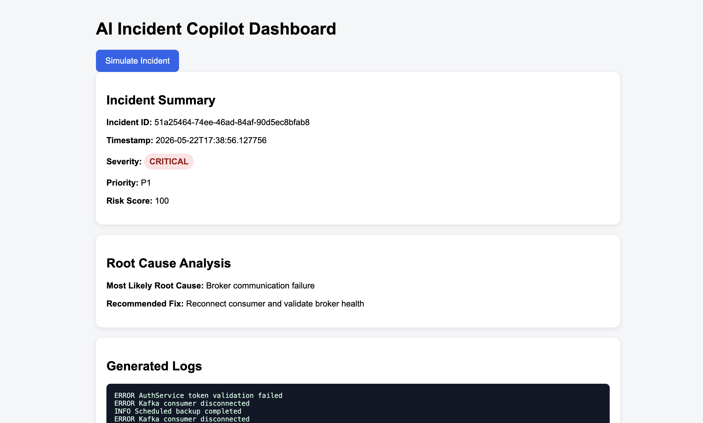
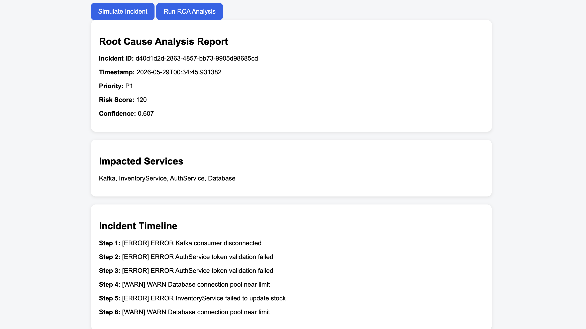
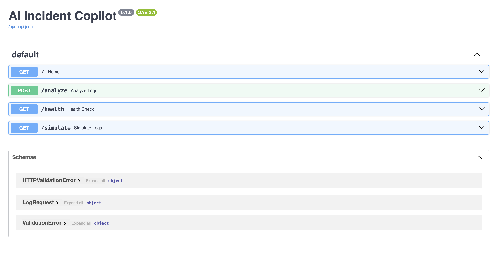

# AI Incident Copilot

An AI-powered incident analysis and retrieval system built using FastAPI, vector embeddings, and semantic search.

## Features

## Features

- AI-powered incident severity detection
- Semantic incident retrieval using FAISS embeddings
- Risk scoring and incident prioritization
- Interactive FastAPI dashboard
- Root Cause Analysis (RCA) workflow
- Impacted service detection
- Incident timeline reconstruction
- Automated remediation planning
- Automated incident postmortem generation
- Dockerized deployment

---

# Architecture

Logs
↓
Parser
↓
Incident Detector
↓
Embedding Generator
↓
Vector Search
↓
Historical Incident Retrieval
↓
Recommended Fix

---

# Tech Stack

- Python
- FastAPI
- Sentence Transformers
- FAISS
- NumPy
- Pydantic

---

# API Endpoints

## Analyze Logs

POST `/analyze`

Example request:

```json
{
  "logs": "ERROR PaymentService timeout"
}
```

---

## Health Check

GET `/health`

---

# Example Output

```json
{
  "severity": "MEDIUM",
  "most_likely_root_cause": "Third-party payment provider latency",
  "recommended_fix": "Add exponential backoff and retry queue"
}
```

---

# Run Locally

```bash
python3 -m venv venv
source venv/bin/activate
pip install -r requirements.txt
uvicorn app.main:app --reload
```

---

# Future Improvements

- Kafka-based real-time log streaming
- OpenAI-powered root cause analysis
- LangGraph multi-agent workflows
- Grafana dashboards
- Docker/Kubernetes deployment
- ML-based anomaly detection
---

# Run with Docker

## Build Docker image

```bash
docker build -t ai-incident-copilot .
```

## Run Docker container

```bash
docker run -p 8000:8000 ai-incident-copilot
```

## Open API Docs

http://127.0.0.1:8000/docs

# Screenshots

## Dashboard



## RCA Dashboard



## API Documentation


## RCA Endpoint

Run advanced root cause analysis:

```bash
GET /simulate-rca
